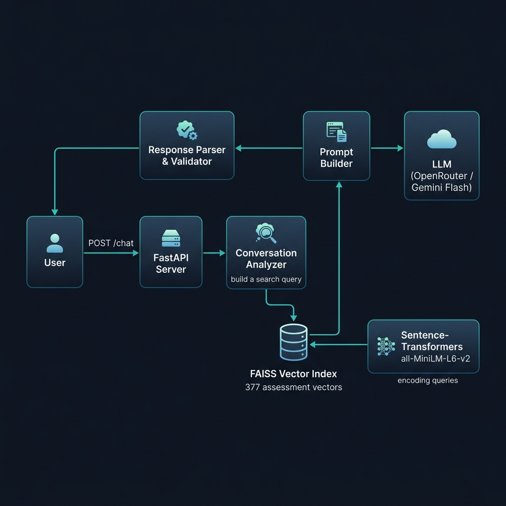

<](https://python.org)
[](https://fastapi.tiangolo.com)
[](https://github.com/facebookresearch/faiss)
[](LICENSE)

**Turn a vague hiring need into a grounded shortlist of SHL assessments — through natural conversation.**

[Architecture](#architecture) · [Quick Start](#quick-start) · [API Reference](#api-reference) · [Design Decisions](#design-decisions) · [Evaluation](#evaluation)

</div>

---

## 💡 The Problem

Hiring managers rarely know the exact assessment they need. Traditional catalog search demands precise keywords and domain vocabulary upfront — a poor fit for users who are still shaping their requirements. This creates a gap between intent and action.

## ✅ The Solution

This project implements a **RAG-powered conversational agent** that guides users from vague intent (_"I'm hiring a Java developer"_) to a grounded shortlist of SHL assessments through multi-turn dialogue. The agent:

- 🔍 **Clarifies** ambiguous queries before recommending
- 📋 **Recommends** 1–10 assessments with real catalog URLs
- 🔄 **Refines** the shortlist when constraints change mid-conversation
- ⚖️ **Compares** assessments using only catalog-grounded data
- 🛡️ **Stays in scope** — refuses off-topic, legal, and prompt-injection attempts

Every recommendation is traceable to the SHL product catalog. Zero hallucinated URLs.

---

## 🏗️ Architecture

<div align="center">



</div>

The system follows a **Retrieval-Augmented Generation (RAG)** pattern with strict output validation:

```
User Message
    │
    ▼
┌──────────────────────┐
│   FastAPI Server     │ ◄── Stateless: no session storage
│   POST /chat         │
└──────────┬───────────┘
           │
           ▼
┌──────────────────────┐
│  Query Builder       │ ◄── Extracts search intent from last 4 messages
└──────────┬───────────┘
           │
           ▼
┌──────────────────────┐     ┌────────────────────────┐
│  FAISS Vector Index  │ ◄── │ Sentence-Transformers  │
│  (377 assessments)   │     │ all-MiniLM-L6-v2       │
└──────────┬───────────┘     └────────────────────────┘
           │ top-15 candidates
           ▼
┌──────────────────────┐
│  Prompt Builder      │ ◄── Injects catalog context as sole source of truth
└──────────┬───────────┘
           │
           ▼
┌──────────────────────┐
│  LLM (OpenRouter)    │ ◄── Gemini 2.0 Flash (configurable)
│  temperature=0.2     │
└──────────┬───────────┘
           │ raw JSON
           ▼
┌──────────────────────┐
│  Response Validator  │ ◄── URL allowlist, schema enforcement, cap @10
└──────────┴───────────┘
           │
           ▼
     ChatResponse JSON
```

### Key Architectural Choices

| Decision | Rationale |
|----------|-----------|
| **FAISS with cosine similarity** | Sub-millisecond search over 377 vectors; no external DB dependency |
| **all-MiniLM-L6-v2 embeddings** | 90 MB model, 384-dim vectors — fast encoding with strong semantic quality |
| **OpenRouter gateway** | Swap LLMs freely (Gemini Flash, Claude, GPT-4o) via a single env var |
| **URL allowlisting** | Every recommended URL is validated against FAISS-retrieved results — LLM cannot hallucinate links |
| **Stateless API** | Full conversation history on every request — simplifies deployment, enables horizontal scaling |

---

## 📁 Project Structure

```
shl-assessment-recommender/
│
├── main.py                  # FastAPI app — GET /health, POST /chat
├── models.py                # Pydantic schemas (request/response contracts)
│
├── agent/
│   ├── llm.py               # Core agent logic — RAG pipeline orchestration
│   └── prompt.py            # System prompt with behavioral rules & output format
│
├── retrieval/
│   ├── build_index.py       # Offline: embed catalog → FAISS index
│   ├── search.py            # Runtime: semantic search + optional hard filters
│   ├── faiss.index          # Pre-built vector index (384-dim, IndexFlatIP)
│   └── index_map.json       # FAISS row → assessment ID mapping
│
├── catalog/
│   ├── raw_catalog.json     # Raw SHL API dump
│   └── shl_catalog.json     # Cleaned & normalized (377 assessments)
│
├── scraper.py               # Playwright-based SHL catalog scraper
├── process_catalog.py       # Raw JSON → clean catalog converter
│
├── test_agent.py            # End-to-end agent tests (4 scenarios)
├── test_search.py           # FAISS retrieval quality tests
│
├── requirements.txt         # Pinned dependencies
├── .env                     # API keys (not committed)
└── .gitignore
```

---

## 🚀 Quick Start

### Prerequisites

- Python 3.11+ (tested on 3.13)
- An [OpenRouter API key](https://openrouter.ai/keys) (free tier available)

### 1. Clone & Install

```bash
git clone <repo-url>
cd shl-assessment-recommender

python -m venv myenv
source myenv/bin/activate    # Windows: myenv\Scripts\activate

pip install -r requirements.txt
```

### 2. Configure Environment

```bash
cp .env.example .env
# Edit .env and add your API key:
```

```env
OPENROUTER_API_KEY=sk-or-v1-your-key-here
OPENROUTER_MODEL=google/gemini-2.0-flash-exp:free
```

### 3. Build the Vector Index (one-time)

> **Skip this step** if `retrieval/faiss.index` already exists.

```bash
# Option A: Use the pre-processed catalog (recommended)
python retrieval/build_index.py

# Option B: Re-scrape the catalog from SHL's website
pip install playwright && python -m playwright install chromium
python scraper.py           # → catalog/raw_catalog.json
python process_catalog.py   # → catalog/shl_catalog.json
python retrieval/build_index.py
```

### 4. Run the Server

```bash
uvicorn main:app --reload --port 8000
```

### 5. Test It

```bash
# Health check
curl http://localhost:8000/health

# Single-turn recommendation
curl -X POST http://localhost:8000/chat \
  -H "Content-Type: application/json" \
  -d '{
    "messages": [
      {"role": "user", "content": "I need to hire a mid-level Java developer who works with stakeholders"}
    ]
  }'
```

---

## 📡 API Reference

### `GET /health`

Readiness check. Returns immediately (or within 2 min on cold start).

```json
{"status": "ok"}
```

### `POST /chat`

Stateless conversational endpoint. Send the **full** conversation history on every call.

#### Request Body

```json
{
  "messages": [
    {"role": "user", "content": "Hiring a Java developer who works with stakeholders"},
    {"role": "assistant", "content": "{\"reply\": \"Sure. What seniority level?\", ...}"},
    {"role": "user", "content": "Mid-level, around 4 years"}
  ]
}
```

#### Response

```json
{
  "reply": "Here are 5 assessments that fit a mid-level Java developer with stakeholder interaction needs.",
  "recommendations": [
    {
      "name": "Java 8 (New)",
      "url": "https://www.shl.com/products/product-catalog/view/java-8-new/",
      "test_type": "K"
    },
    {
      "name": "OPQ32r",
      "url": "https://www.shl.com/products/product-catalog/view/opq32r/",
      "test_type": "P"
    }
  ],
  "end_of_conversation": false
}
```

| Field | Type | Description |
|-------|------|-------------|
| `reply` | `string` | Natural-language agent message (1–4 sentences) |
| `recommendations` | `Recommendation[]` | Empty when clarifying/refusing; 1–10 items when recommending |
| `end_of_conversation` | `boolean` | `true` only when the user confirms the task is complete |

> **Schema is non-negotiable.** The automated evaluator depends on this exact structure.

---

## 🧩 Design Decisions

### Retrieval Strategy

**Why RAG over pure LLM?** A standalone LLM would hallucinate assessment names and URLs. By grounding every response in FAISS-retrieved catalog entries, we guarantee that:
- Every URL exists in the SHL catalog
- Assessment metadata (type, duration, job levels) is factual
- The LLM acts as a reasoning layer, not a knowledge store

**Why top-15 retrieval?** We retrieve 15 candidates and let the LLM select the best 1–10. This gives the model enough variety to form a diverse shortlist while keeping the context window small (~2K tokens of catalog data).

### Prompt Engineering

The system prompt (`agent/prompt.py`) encodes five behavioral rules:

1. **Clarify first** — Vague queries get a question, not a recommendation
2. **Recommend 1–10** — Only from the retrieved catalog subset
3. **Refine, don't restart** — Mid-conversation edits update the shortlist
4. **Compare from data** — No reliance on the LLM's parametric knowledge
5. **Stay in scope** — Refuse off-topic, legal questions, and injection attempts

### Safety Layers

```
LLM Output
    │
    ├── Strip markdown fences (```json ... ```)
    ├── Extract JSON object from mixed text
    ├── Parse with json.loads (fallback to graceful error)
    ├── Validate each URL against FAISS-retrieved allowlist
    └── Cap recommendations at 10
```

The URL allowlist is the critical safety net: even if the LLM generates a plausible-looking URL, it's rejected unless it was returned by FAISS for the current query.

### Model Choice

We use **Gemini 2.0 Flash** via OpenRouter's free tier for several reasons:
- Fast inference (~1–2s per turn) — well within the 30s timeout
- Strong instruction-following for structured JSON output
- Free tier makes deployment cost-effective
- Easily swappable to any OpenAI-compatible model via env var

---

## 🧪 Evaluation

### Test Suite

```bash
# Run end-to-end agent tests (4 scenarios)
python test_agent.py

# Run retrieval quality tests
python test_search.py
```

### Test Scenarios

| # | Scenario | Expected Behavior |
|---|----------|-------------------|
| 1 | Vague query: _"I need an assessment"_ | Ask a clarifying question, no recommendations |
| 2 | Clear query: _"Mid-level Java developer with stakeholders"_ | Return relevant assessments (K + P types) |
| 3 | Multi-turn refinement: _"Add a personality test"_ | Update shortlist, keep relevant prior picks |
| 4 | Off-topic: _"Write me a job description"_ | Politely refuse, stay in scope |

### Scoring Dimensions (per assignment spec)

| Metric | What It Measures |
|--------|-----------------|
| **Hard evals** | Schema compliance, catalog-only URLs, ≤8 turns |
| **Recall@10** | Fraction of relevant assessments in top-10 recommendations |
| **Behavior probes** | Clarification, refusal, refinement, hallucination rate |

---

## ⚙️ Configuration

All configuration is via environment variables in `.env`:

| Variable | Default | Description |
|----------|---------|-------------|
| `OPENROUTER_API_KEY` | — | Your OpenRouter API key |
| `OPENROUTER_MODEL` | `google/gemini-2.0-flash-exp:free` | LLM model identifier |

To use a different model (e.g., Claude, GPT-4o), simply update `OPENROUTER_MODEL`:

```env
OPENROUTER_MODEL=anthropic/claude-3.5-sonnet
```

---

## 🛠️ Data Pipeline

The catalog goes through three stages:

```
SHL Website                      Raw API JSON                    Clean Catalog
shl.com/product-catalog/   →   raw_catalog.json (429 KB)   →   shl_catalog.json (308 KB)
                                                                     │
                            scraper.py / curl                  process_catalog.py
                                                                     │
                                                                     ▼
                                                              FAISS Index
                                                              faiss.index (579 KB)
                                                              377 vectors × 384 dims
```

| Stage | Script | Output |
|-------|--------|--------|
| **Scrape** | `scraper.py` | `catalog/raw_catalog.json` — raw assessment data |
| **Clean** | `process_catalog.py` | `catalog/shl_catalog.json` — normalized 377 entries |
| **Index** | `retrieval/build_index.py` | `retrieval/faiss.index` + `index_map.json` |

### Catalog Statistics

| Metric | Value |
|--------|-------|
| Total assessments | **377** |
| With descriptions | **377** (100%) |
| Test types | K (229), P (45), S (25), A (20), B (10), C (4), D (5), E (1), + combos |
| Embedding model | `all-MiniLM-L6-v2` (384 dimensions) |
| Index type | `IndexFlatIP` (exact cosine similarity) |

---

## 🚢 Deployment

The app is designed for free-tier deployment on platforms like **Render**, **Railway**, or **Fly.io**.

```bash
# Production start (no --reload)
uvicorn main:app --host 0.0.0.0 --port $PORT
```

Key deployment considerations:
- **Cold start**: The `/health` endpoint responds immediately; the evaluator allows up to 2 minutes for warm-up
- **Memory**: ~500 MB (embedding model + FAISS index + Python runtime)
- **Latency**: p95 < 5s per turn (dominated by LLM inference)
- **Stateless**: No database, no session store — scales horizontally

---

## 📜 License

MIT

---

<div align="center">

**Built for the SHL AI Intern Assessment** · 2026

</div>
]]>
